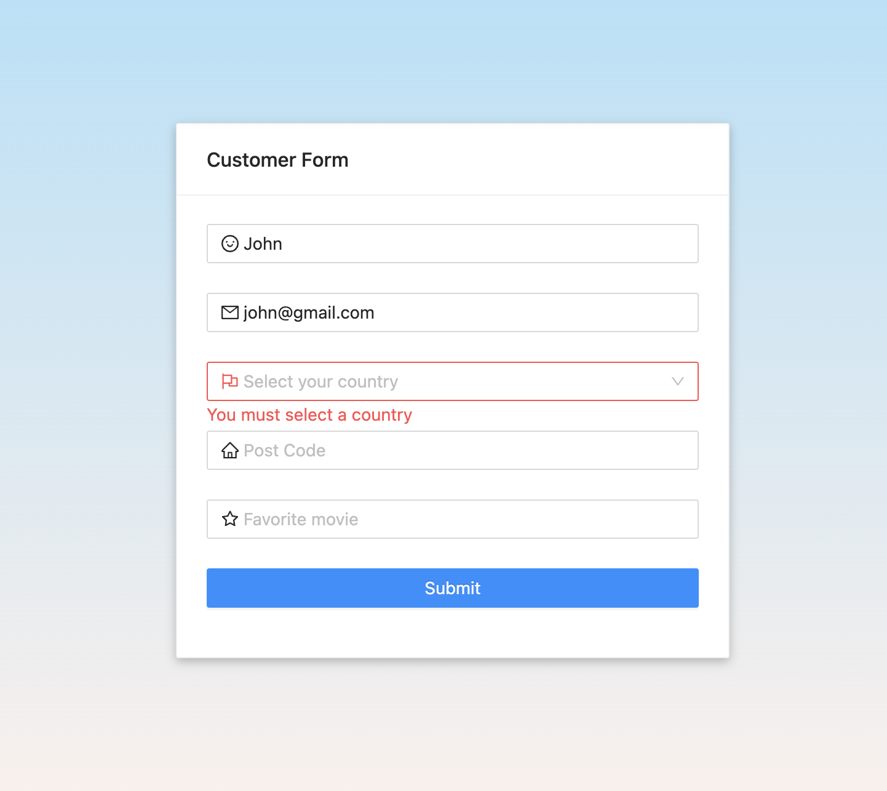

# Angular Form (Nx + DDD)

Angular form with validations using Angular 16 (DDD approach), Nx, NgRx, RxJS, Jest, Cypress and NgZorro UI.

#### Start the app

- Clone the Project - `https://github.com/bytebruno/angular-nx-ddd.git`
- Install the dependencies - `npm install`
- Start the web app - `npm start`
- The application will be running on `http://localhost:4200`

#### Run tests

- Run unit tests - `npm run test`
- Run e2e tests - `npm run e2e`
  - Seeing on browser - `npm run e2e:watch`

#### Other commands

- Run build - `npm run build`
- Run lint - `npm run lint`

## Technologies

- [Angular 16](https://angular.io/)
- [Nx](https://nx.dev/)
- [NgRx](https://ngrx.io/)
- [RxJS](https://rxjs.dev/)
- [Jest](https://jestjs.io/)
- [Cypress](https://www.cypress.io/)
- [NgZorro](https://ng.ant.design/docs/introduce/en)

## Screenshots

### Form validation

### Form with autocomplete

### Summary after submit

